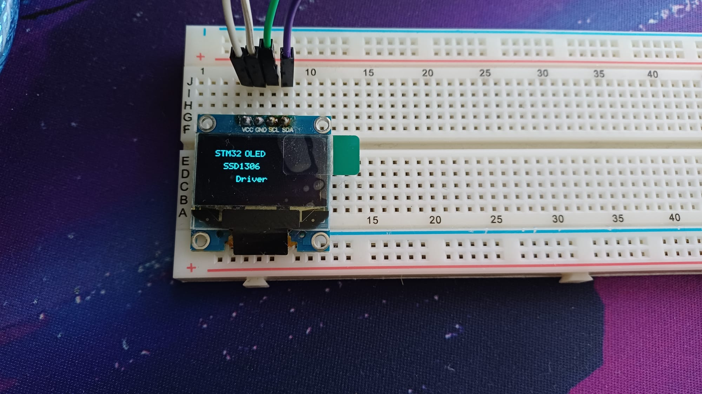
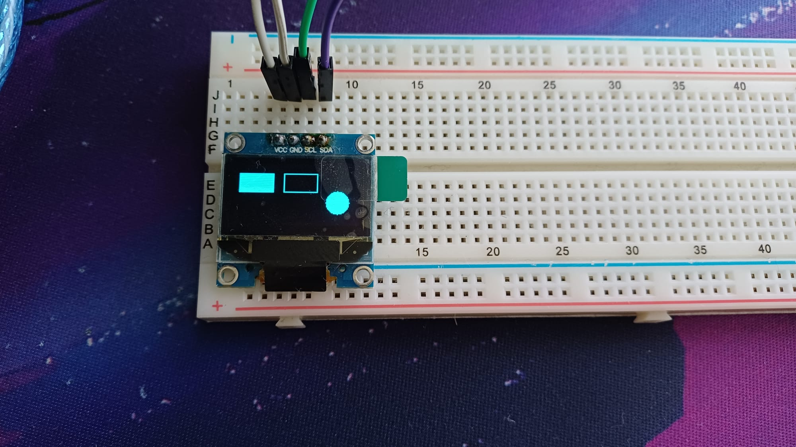
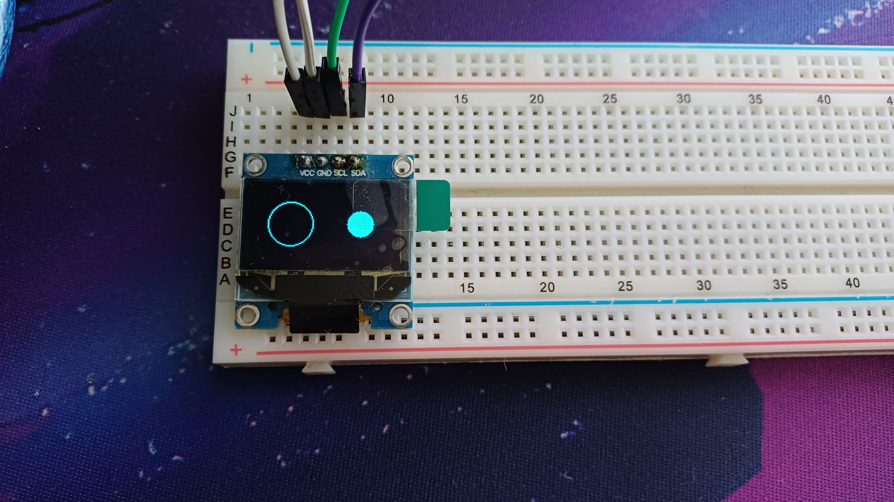
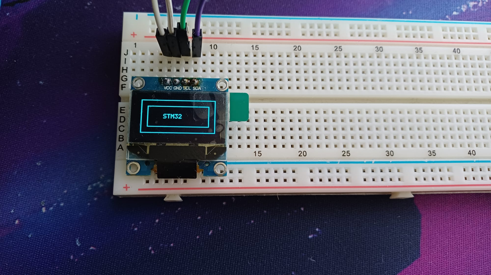
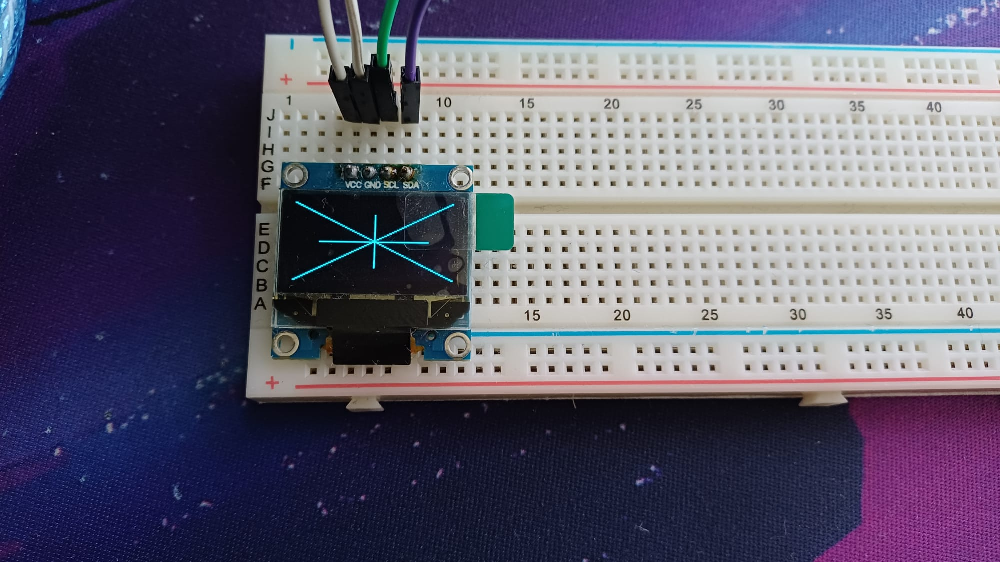

# STM32 SSD1306 OLED Driver

STM32 mikrodenetleyiciler için HAL I2C tabanlı SSD1306 OLED sürücüsü.

Bu proje; SSD1306 tabanlı 128x64 OLED ekranlarda metin gösterimi, framebuffer kullanımı ve temel grafik çizim işlemlerini destekler.

## Quick Start

Projeyi STM32 projenize eklemek için aşağıdaki dosyaları kullanın:

```text
Inc/
├── OledScreen_Driver.h
├── oled_framebuffer.h
└── oled_fonts.h

Src/
├── OledScreen_Driver.c
├── oled_framebuffer.c
└── oled_fonts.c
```

Header dosyalarını projenizin `Core/Inc` klasörüne, source dosyalarını ise `Core/Src` klasörüne ekleyebilirsiniz.

Ardından `main.c` içerisine:

```c
#include "OledScreen_Driver.h"
#include "oled_framebuffer.h"
```

ekleyin.

---

## Basic Initialization

Öncelikle OLED driver ve framebuffer nesnelerini oluşturun:

```c
oled_driver_t oled;
oled_framebuffer_t framebuffer;
```

I2C handle'ını OLED driver'a bağlayın:

```c
oled.hi2c = &hi2c1;
```

Daha sonra OLED ve framebuffer'ı başlatın:

```c
Oled_Init(&oled, normal_mode, SCAN_REVERSE);

oled_framebuffer_init(&framebuffer);

oled_clear(&oled);
```

Örnek:

```c
int main(void)
{
    HAL_Init();

    SystemClock_Config();

    MX_GPIO_Init();
    MX_I2C1_Init();

    oled.hi2c = &hi2c1;

    Oled_Init(&oled, normal_mode, SCAN_REVERSE);

    oled_framebuffer_init(&framebuffer);

    oled_clear(&oled);

    while (1)
    {
    }
}
```

---

# Text Example

Framebuffer üzerine yazı yazmak için önce cursor konumu belirlenir:

```c
oled_framebuffer_clear(&framebuffer);

oled_framebuffer_set_cursor(&framebuffer, 10, 10);

oled_framebuffer_printf(&framebuffer, "STM32 OLED");

oled_framebuffer_update(&framebuffer, &oled);
```

`oled_framebuffer_update()` çağrılana kadar yapılan değişiklikler yalnızca RAM üzerindeki framebuffer içerisinde tutulur.

---

# Graphics Examples

## Rectangle

```c
oled_framebuffer_clear(&framebuffer);

oled_framebuffer_draw_rectangle(&framebuffer,
                                15,
                                15,
                                98,
                                34);

oled_framebuffer_update(&framebuffer, &oled);
```

## Filled Rectangle

```c
oled_framebuffer_clear(&framebuffer);

oled_framebuffer_fill_rectangle(&framebuffer,
                                5,
                                10,
                                35,
                                20);

oled_framebuffer_update(&framebuffer, &oled);
```

## Circle

```c
oled_framebuffer_clear(&framebuffer);

oled_framebuffer_draw_circle(&framebuffer,
                             32,
                             32,
                             20);

oled_framebuffer_update(&framebuffer, &oled);
```

## Filled Circle

```c
oled_framebuffer_fill_circle(&framebuffer,
                             95,
                             32,
                             12);
```

## Line

```c
oled_framebuffer_draw_line(&framebuffer,
                           0,
                           0,
                           127,
                           63);
```

Horizontal ve vertical çizgiler için:

```c
oled_framebuffer_draw_hline(&framebuffer,
                            20,
                            32,
                            88);

oled_framebuffer_draw_vline(&framebuffer,
                            64,
                            10,
                            44);
```

---

# Full Demo Example

`Examples/main.c` dosyasında sürücünün farklı özelliklerini sırayla gösteren örnek uygulama bulunmaktadır.

Basit bir demo döngüsü:

```c
while (1)
{
    /* Text */

    oled_framebuffer_clear(&framebuffer);

    oled_framebuffer_set_cursor(&framebuffer, 10, 10);
    oled_framebuffer_printf(&framebuffer, "STM32 OLED");

    oled_framebuffer_set_cursor(&framebuffer, 20, 25);
    oled_framebuffer_printf(&framebuffer, "SSD1306");

    oled_framebuffer_set_cursor(&framebuffer, 35, 40);
    oled_framebuffer_printf(&framebuffer, "Driver");

    oled_framebuffer_update(&framebuffer, &oled);

    HAL_Delay(2000);


    /* Rectangles */

    oled_framebuffer_clear(&framebuffer);

    oled_framebuffer_draw_rectangle(&framebuffer,
                                    5,
                                    5,
                                    118,
                                    54);

    oled_framebuffer_draw_rectangle(&framebuffer,
                                    15,
                                    15,
                                    98,
                                    34);

    oled_framebuffer_set_cursor(&framebuffer, 40, 28);
    oled_framebuffer_printf(&framebuffer, "STM32");

    oled_framebuffer_update(&framebuffer, &oled);

    HAL_Delay(2000);


    /* Circles */

    oled_framebuffer_clear(&framebuffer);

    oled_framebuffer_draw_circle(&framebuffer,
                                 32,
                                 32,
                                 20);

    oled_framebuffer_fill_circle(&framebuffer,
                                 95,
                                 32,
                                 12);

    oled_framebuffer_update(&framebuffer, &oled);

    HAL_Delay(2000);


    /* Lines */

    oled_framebuffer_clear(&framebuffer);

    oled_framebuffer_draw_line(&framebuffer,
                               0,
                               0,
                               127,
                               63);

    oled_framebuffer_draw_line(&framebuffer,
                               127,
                               0,
                               0,
                               63);

    oled_framebuffer_draw_hline(&framebuffer,
                                20,
                                32,
                                88);

    oled_framebuffer_draw_vline(&framebuffer,
                                64,
                                10,
                                44);

    oled_framebuffer_update(&framebuffer, &oled);

    HAL_Delay(2000);
}
```

---

# Driver Structure

Proje üç ana parçadan oluşur:

```text
OledScreen_Driver
        |
        |---- SSD1306 configuration
        |---- I2C command/data transmission
        |---- Cursor control
        |---- Direct text output
        |
oled_framebuffer
        |
        |---- Pixel control
        |---- Line drawing
        |---- Rectangle drawing
        |---- Circle drawing
        |---- Text rendering
        |
oled_fonts
        |
        |---- 5x7 font data
```

---

# SSD1306 Driver

`OledScreen_Driver.c` SSD1306 ile doğrudan haberleşen alt seviye katmandır.

Driver içerisinde:

- OLED initialization
- Display offset configuration
- Display start line configuration
- Segment remap
- COM scan direction
- Contrast configuration
- Charge pump configuration
- Memory addressing mode
- Column address configuration
- Page address configuration
- OLED clear
- Cursor positioning
- Direct character output

fonksiyonları bulunmaktadır.

SSD1306 komutları I2C üzerinden gönderilir.

Command transfer için control byte:

```text
0x00
```

Display data transfer için control byte:

```text
0x40
```

---

# Framebuffer

SSD1306 128x64 çözünürlüğe sahip olduğu için framebuffer boyutu:

```text
128 × 64 = 8192 bit
8192 / 8 = 1024 byte
```

Framebuffer:

```c
uint8_t buffer[1024];
```

olarak tutulur.

Bir pixel'in framebuffer içerisindeki konumu:

```c
page = y / 8;

index = (page * 128) + x;

bit = y % 8;
```

şeklinde hesaplanır.

Pixel aktif hale getirilirken:

```c
buffer[index] |= (1U << bit);
```

pixel temizlenirken:

```c
buffer[index] &= ~(1U << bit);
```

kullanılır.

---

# Graphics Functions

Framebuffer katmanı aşağıdaki grafik fonksiyonlarını sağlar:

```c
oled_framebuffer_set_pixel()

oled_framebuffer_clear_pixel()

oled_framebuffer_write_pixel()

oled_framebuffer_draw_hline()

oled_framebuffer_draw_vline()

oled_framebuffer_draw_line()

oled_framebuffer_draw_rectangle()

oled_framebuffer_fill_rectangle()

oled_framebuffer_draw_circle()

oled_framebuffer_fill_circle()
```

Çizim işlemleri doğrudan OLED'e gönderilmez.

Önce framebuffer üzerinde oluşturulur ve ardından:

```c
oled_framebuffer_update(&framebuffer, &oled);
```

çağrısı ile OLED ekranın GDDRAM belleğine gönderilir.

---

# Text Rendering

Projede 5x7 bitmap font kullanılmaktadır.

Desteklenen karakter grupları:

- A-Z
- a-z
- 0-9
- `.`
- `,`
- `:`
- `-`
- `/`

Font verileri `oled_fonts.c` içerisinde tutulmaktadır.

Framebuffer üzerinde yazı yazmak için:

```c
oled_framebuffer_set_cursor(&framebuffer, 10, 10);

oled_framebuffer_printf(&framebuffer, "STM32");
```

kullanılabilir.

---

# Direct Text Mode

Framebuffer kullanılmadan da OLED üzerine doğrudan yazı gönderilebilir.

Örnek:

```c
oled_set_cursor(&oled, 0, 0);

oled_printf(&oled, "STM32");
```

Bu yöntem basit metin uygulamalarında kullanılabilir.

Grafik çizimi veya pixel seviyesinde kontrol gerektiğinde framebuffer kullanılması gerekir.

---

# Demo Outputs

## Text Rendering



---

## Rectangle and Filled Shapes



---

## Circle Drawing



---

## Rectangle + Text



---

## Line Drawing



---

# Repository Structure

```text
STM32-SSD1306-OLED-Driver/
│
├── Inc/
│   ├── OledScreen_Driver.h
│   ├── oled_framebuffer.h
│   └── oled_fonts.h
│
├── Src/
│   ├── OledScreen_Driver.c
│   ├── oled_framebuffer.c
│   └── oled_fonts.c
│
├── Examples/
│   └── main.c
│
├── images/
│   ├── demo_text.jpeg
│   ├── demo_shapes.jpeg
│   ├── demo_circles.jpeg
│   ├── demo_rectangle_text.jpeg
│   └── demo_lines.jpeg
│
└── README.md
```

---

# Hardware

Test edilen yapı:

- STM32
- SSD1306 OLED
- 128x64 resolution
- I2C communication
- STM32 HAL library

OLED I2C address:

```c
0x3C
```

STM32 HAL kullanırken address değeri:

```c
(0x3C << 1)
```

olarak kullanılmaktadır.

---

# Notes

Bu proje SSD1306 sürücüsünün çalışma mantığını öğrenmek ve STM32 üzerinde temel bir grafik altyapısı oluşturmak amacıyla geliştirilmiştir.

Sürücü hem doğrudan OLED GDDRAM erişimini hem de RAM tabanlı framebuffer kullanımını göstermektedir.
